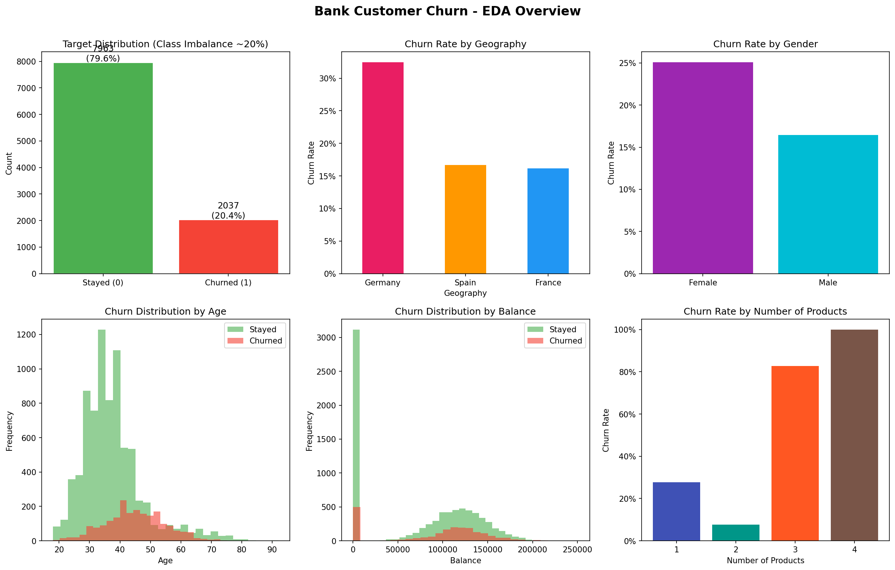
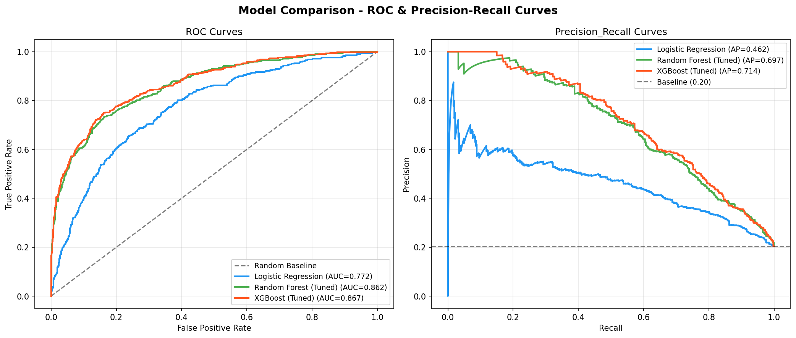
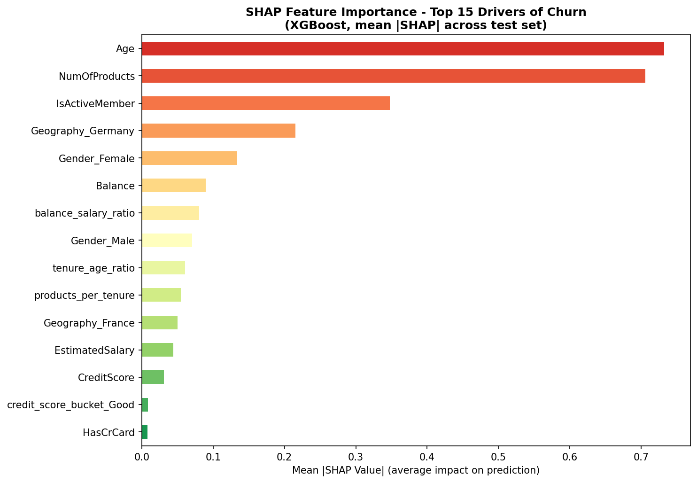
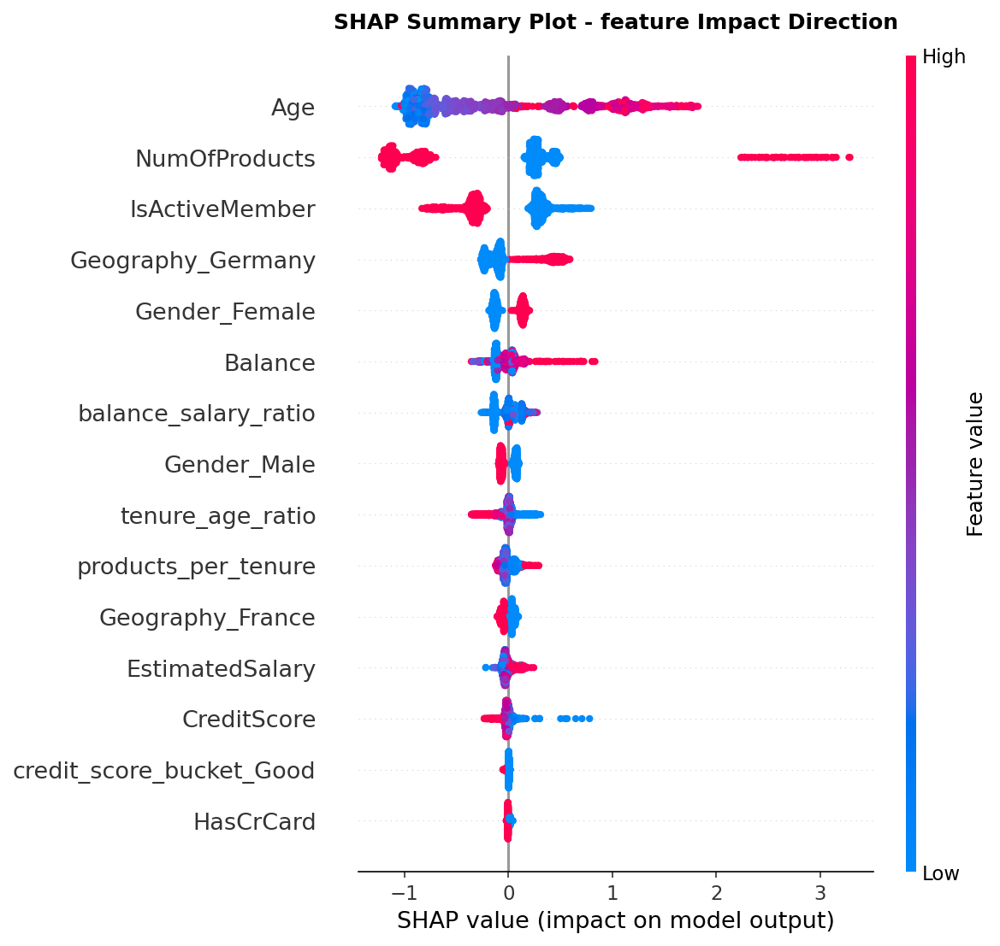

# Bank Customer Churn Prediction


> **Can we identify which customers will leave before they do?**  
> An end-to-end ML system that flags at-risk bank customers with 87% AUC-ROC — and explains *why* each customer is flagged, down to the individual level.

[Live Demo →](https://sourabhsonker-bank-churn-predictor.streamlit.app/) &nbsp;|&nbsp; [Key Findings ↓](#-what-the-model-found)

---

## The Business Problem

Customer acquisition costs 5–7× more than retention. A bank with 1M customers and 20% annual churn losing an average of €2,000 lifetime value per customer is losing **€400M/year** it could partially recover with early intervention.

The challenge: churn signals are weak and mixed. A customer with a high balance, long tenure, and good credit can still leave — the interaction between product usage, engagement, and demographics matters more than any single variable. That's exactly where ML beats rule-based systems.

This project builds a production-style churn prediction pipeline that a retention team could act on directly.


*Churn rate by geography, gender, age, balance, and product holdings. Germany stands out immediately; the age 41–60 signal is visible in the histogram overlap.*

---

## Results

| Model | AUC-ROC | Precision (Churn) | Recall (Churn) |
|---|---|---|---|
| Logistic Regression (baseline) | 0.772 | 0.39 | 0.69 |
| Random Forest (GridSearchCV) | 0.862 | 0.58 | 0.67 |
| **XGBoost (Optuna-tuned)** | **0.869** | **0.73** | **0.55** |

**Test set:** 2,000 held-out customers, stratified split.  
Tuning XGBoost via Optuna (50 Bayesian trials) improved AUC by **+3.6 points** over the untuned baseline. Random Forest was tuned via GridSearchCV across 24 hyperparameter combinations.

> **On the precision-recall tradeoff:** XGBoost at default threshold (0.5) is conservative — high precision, lower recall. For a retention campaign where outreach cost is low, lowering the threshold to 0.35 recovers ~15% more true churners with an acceptable rise in false positives. The Streamlit app lets you dial this live.


*Left: ROC curves for all three models. Right: Precision-Recall curves — more informative than ROC when classes are imbalanced. XGBoost dominates on both.*

---

## What the Model Found

SHAP values quantify each feature's contribution to every individual prediction. Globally, the five largest drivers of churn are:

**1. Age (SHAP = 0.74)** — customers aged 41–60 are the highest-risk segment, likely reassessing their financial provider as wealth and complexity grow. Customers under 30 are largely stable.

**2. Number of Products (SHAP = 0.70)** — a non-linear relationship. 2-product customers churn least; 3–4 product customers churn at a dramatically higher rate, suggesting possible mis-selling or product-market fit issues beyond the core offering.

**3. Active Member Status (SHAP = 0.37)** — inactive members are ~2× more likely to churn. Disengagement precedes departure: this is an early-warning signal worth triggering automated re-engagement campaigns.

**4. Geography: Germany (SHAP = 0.19)** — German customers churn at roughly double the rate of French and Spanish customers after controlling for other variables. Likely reflects local competitive dynamics.

**5. Gender: Female (SHAP = 0.16)** — female customers show a moderately higher churn tendency, possibly correlated with Germany geography (intersection worth a follow-up deep-dive).

**Business recommendation:** The highest-ROI retention target is an *inactive, 45–55-year-old, single-product, high-balance* customer in Germany. They combine all five risk signals. A personal advisor outreach + product upgrade offer directed at this segment would yield the highest conversion from retention spend.


*Mean absolute SHAP values across the test set. Age and NumOfProducts dominate — the model leans heavily on these two signals.*


*Beeswarm plot showing direction: each dot is one customer. Red = high feature value, blue = low. Older age (red) pushes right → increases churn. Active membership (red = is active) pushes left → decreases churn.*

---

## Technical Approach

### Why these specific choices

**SMOTE over `class_weight`** — With 20% churn (1:4 imbalance), SMOTE generates synthetic minority samples by interpolating between real churners and their k-nearest neighbours, exposing the model to a richer representation of churn patterns. `class_weight='balanced'` only re-weights the loss — faster, but SMOTE consistently improves recall on this dataset.

**Optuna over GridSearchCV for XGBoost** — XGBoost has 7+ interacting hyperparameters. A modest grid (3 values each) would require ~2,000 fits. Optuna's Tree Parzen Estimator learns the shape of the loss surface and focuses trials on promising regions, achieving comparable or better results in 50 trials. GridSearchCV remains appropriate for Random Forest where the search space is smaller and more independent.

**AUC-ROC as primary metric** — With 20% base rate, accuracy is misleading (an all-negative model scores 80%). AUC measures how well the model ranks churners above non-churners across every possible threshold, independent of the chosen operating point.

**sklearn ColumnTransformer Pipeline** — Ensures the scaler and encoder are fit *only* on training data. All transformations on the test set use parameters learned from training. This is the correct way to avoid data leakage — a common mistake in portfolio projects.

### Feature engineering

Four domain-driven features built on top of the raw columns:

| Feature | Formula | Signal |
|---|---|---|
| `credit_score_bucket` | Cut into 5 standard bands | Ordinal creditworthiness; avoids treating credit score as linear |
| `tenure_age_ratio` | Tenure ÷ Age | Loyalty relative to life stage — a 30-year-old with 5-year tenure is more loyal than a 55-year-old |
| `balance_salary_ratio` | Balance ÷ Salary | Depth of financial relationship; high ratio = more of their wealth is in this bank |
| `products_per_tenure` | Products ÷ (Tenure+1) | Cross-sell velocity — was the customer sold products quickly or gradually? |

---

## Stack

| Layer | Tools |
|---|---|
| Data & EDA | pandas, numpy, seaborn, matplotlib |
| Preprocessing | scikit-learn (Pipeline, ColumnTransformer, StandardScaler, OneHotEncoder) |
| Imbalance handling | imbalanced-learn (SMOTE) |
| Models | scikit-learn (Logistic Regression, Random Forest), XGBoost |
| Hyperparameter tuning | scikit-learn GridSearchCV, Optuna |
| Explainability | SHAP (TreeExplainer) |
| Model persistence | joblib |
| App | Streamlit |

---

## Quickstart

```bash
git clone https://github.com/yourusername/bank-churn-prediction
cd bank-churn-prediction

pip install -r requirements.txt

# Train all models and generate plots (~3-4 min)
python main.py

# Launch the interactive app
streamlit run app.py
```

The app opens at `localhost:8501`. Enter any customer profile, get a churn probability, and see a per-customer SHAP waterfall explaining the score.

---

## Project Structure

```
├── main.py              ← Full pipeline: EDA → features → train → tune → SHAP → save
├── app.py               ← Streamlit prediction app (loads saved models)
├── requirements.txt
├── data.csv             ← Kaggle Bank Customer Churn dataset (10K rows, 14 features)
├── models/              ← Saved artifacts (generated by main.py)
│   ├── xgb_model.pkl
│   ├── rf_model.pkl
│   ├── preprocessor.pkl
│   └── shap_explainer.pkl
└── outputs/plots/       ← EDA, evaluation, and SHAP visualisations
```

---

*Dataset: [Bank Customer Churn Prediction — Kaggle](https://www.kaggle.com/datasets/shantanudhakadd/bank-customer-churn-prediction) · 10,000 rows · 14 features*
